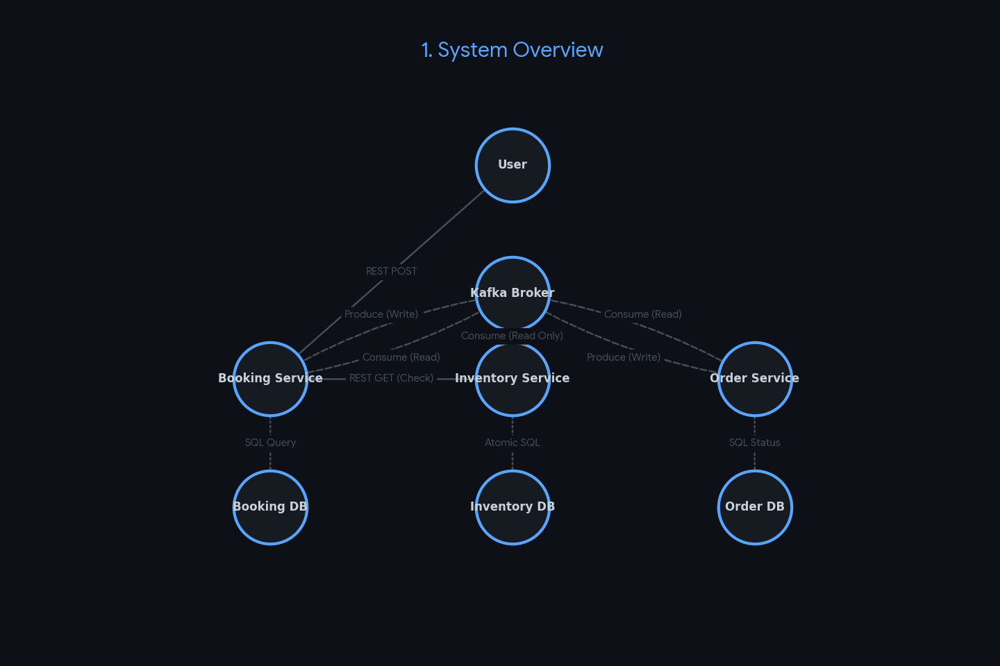

# High-Concurrency Distributed Ticket Reservation System

A robust, distributed microservices ecosystem designed to handle high-traffic ticket sales with data integrity. This project demonstrates advanced architectural patterns for managing distributed transactions and high-concurrency race conditions using a modern, containerized stack.

---

## Architecture & Services

The system is divided into three specialized microservices that maintain a decoupled architecture through asynchronous event-driven communication:

* **Booking Service:** Orchestrates the reservation lifecycle and manages user-facing booking states.
* **Inventory Service:** The source of truth for seat availability, utilizing optimized persistence logic to handle extreme load.
* **Order Service:** Simulates payment orchestration via internal state transitions. It mimics the financial approval/rejection flow to drive the Saga's success or failure paths without requiring a third-party payment gateway.



---

## Core Technical Capabilities

### Distributed Saga Pattern
The project implements a choreography-based **Saga Pattern** to ensure eventual consistency across distributed databases. Using **Apache Kafka**, the system manages complex transaction flows. The Order Service simulates payment outcomes, triggering automatic "compensating transactions" (rollbacks) to release inventory if a simulated payment failure occurs.

### High-Concurrency Resilience
Engineered for stability during massive traffic spikes. The system employs thread-safe reservation logic at the database level to eliminate race conditions, ensuring zero overselling occurs even under heavy parallel load.

### Containerization & Orchestration
The entire ecosystem is fully **Dockerized**. Using **Docker Compose**, the complex web of microservices, multiple databases, and the Kafka broker can be orchestrated with a single command, ensuring a consistent environment from development to production.

### Environment-Agnostic Configuration
The architecture completely separates configuration from code. Microservices are built into immutable Docker images. Operational details (such as database URLs, credentials, and network endpoints) are injected entirely at runtime.

---

## 🛠️ Technology Stack

* **Language:** Java 21
* **Framework:** Spring Boot 3.x
* **Messaging:** Apache Kafka
* **Containerization:** Docker & Docker Compose
* **Database:** Relational Data (MySQL) with Flyway Migrations
* **Tooling:** Maven, Postman Performance Runner

---

## Getting Started

### Prerequisites
* Docker Desktop
* or Docker Engine

### Installation & Deployment
1.  **Clone the Repository:**
    ```bash
    git clone https://github.com/shruti910/Distributed-Ticket-Booking-System.git
    cd Distributed-Ticket-Booking-System
    ```
2.  **Spin Up Infrastructure:**
    Use the provided Docker Compose file to start Kafka, Zookeeper, and the databases:
    ```bash
    docker-compose up  --build -d
    ```
3. **Accessing the Infrastructure:**

    * Booking Service API: http://localhost:8081/booking-ms
    * Inventory Service API: http://localhost:8080/inventory-ms
    * Order Service API: http://localhost:8082/order-ms
    * Kafka UI Dashboard: http://localhost:8084
---

## Future Roadmap
- [ ] **Observability:** Integration of distributed tracing for cross-service request monitoring
